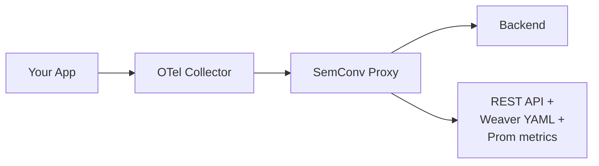

# SemConv Proxy

[](https://github.com/henrikrexed/semconv-proxy/actions/workflows/ci.yaml)
[](https://github.com/henrikrexed/semconv-proxy/actions/workflows/docs.yaml)
[](LICENSE)

**A transparent OTLP proxy that discovers, tracks, and exports OpenTelemetry semantic conventions in real time.**

SemConv Proxy sits between your OpenTelemetry Collectors and your observability backend, observing every signal that flows through it. It builds a live dictionary of every attribute your services actually emit — across metrics, traces, and logs — so platform teams can audit cardinality, detect convention drift, and export OTel Weaver-compatible YAML directly from production telemetry.

📖 **Documentation:** **<https://henrikrexed.github.io/semconv-proxy/>**

---

## Why SemConv Proxy?

OpenTelemetry semantic conventions are how teams agree on attribute names, types, and meaning across services. As OTel adoption scales, organizations hit three recurring problems:

1. **You don't know what you're emitting.** Conventions live in code; what hits the backend often doesn't match.
2. **Cardinality explodes silently.** A single rogue attribute (e.g. `user.id` on a metric) can blow up your bill.
3. **Conventions drift over time.** New attributes appear, types change, services diverge from the registry.

SemConv Proxy solves this by sitting transparently in the pipeline — `App → OTel Collector → SemConv Proxy → Backend` — and giving you:

- **Zero-loss forwarding** — sub-millisecond p99 overhead, backpressure-aware
- **Real-time discovery** — auto-catalog every attribute across metrics, traces, and logs
- **Cardinality intelligence** — HyperLogLog, Count-Min Sketch, and Top-K per attribute
- **Change detection** — track when attributes are added, modified, or removed
- **Weaver export** — generate Weaver-compatible YAML straight from live data
- **Self-observability** — 30+ Prometheus metrics about the proxy itself

## How It Works



Internally: OTLP receivers (HTTP/gRPC) → ring buffer → worker pool → 64-shard concurrent dictionary → Pebble persistence. See the [Architecture docs](https://henrikrexed.github.io/semconv-proxy/architecture/) for the full diagram and data flow.

## Getting Started

### Run with Docker

```bash
docker run -p 4317:4317 -p 4318:4318 -p 8080:8080 \
  ghcr.io/henrikrexed/semconv-proxy:latest \
  --backend-endpoint=otel-collector:4317
```

### Build from source

```bash
git clone https://github.com/henrikrexed/semconv-proxy
cd semconv-proxy
make build
./bin/semconv-proxy --backend-endpoint=localhost:4317
```

### Deploy on Kubernetes

```bash
helm install semconv-proxy ./deployments/helm/semconv-proxy \
  --set backend.endpoint=otel-collector.observability.svc.cluster.local:4317
```

Once running, point your OTel Collectors at the proxy's OTLP endpoints (`:4317` gRPC, `:4318` HTTP) and query the dictionary:

```bash
curl http://localhost:8080/api/v1/dictionary/attributes
curl http://localhost:8080/api/v1/weaver/export > my-conventions.yaml
```

➡️ Full guide: [Getting Started](https://henrikrexed.github.io/semconv-proxy/getting-started/)

## Configuration

| Flag | Env Var | Default | Description |
|------|---------|---------|-------------|
| `--backend-endpoint` | `SEMCONV_PROXY_BACKEND_ENDPOINT` | *(required)* | OTLP backend endpoint |
| `--otlp-http-port` | `SEMCONV_PROXY_OTLP_HTTP_PORT` | `4318` | OTLP/HTTP listen port |
| `--otlp-grpc-port` | `SEMCONV_PROXY_OTLP_GRPC_PORT` | `4317` | OTLP/gRPC listen port |
| `--api-port` | `SEMCONV_PROXY_API_PORT` | `8080` | REST API listen port |
| `--log-level` | `SEMCONV_PROXY_LOG_LEVEL` | `info` | `debug` / `info` / `warn` / `error` |
| `--config` | — | — | Path to YAML config file |

Full reference (storage, ring buffer sizing, retention, TLS, etc.): [Configuration docs](https://henrikrexed.github.io/semconv-proxy/getting-started/configuration/).

## Use Cases

- **Semantic convention discovery** — what does this service actually emit?
- **Cardinality budget monitoring** — catch high-cardinality attributes before they hit your bill
- **Migration tracking** — verify a SemConv migration before/after deployment
- **Observability pipeline auditing** — confirm what reaches the backend
- **Multi-source aggregation** — unify conventions across teams and clusters

Each use case has a dedicated walkthrough with diagrams and code in the [Use Cases section](https://henrikrexed.github.io/semconv-proxy/use-cases/).

## Project Structure

```
.
├── cmd/                # Binary entrypoints
├── internal/           # Core proxy implementation (private)
├── docs/               # MkDocs documentation source
├── deployments/        # Docker, Helm chart, Kubernetes manifests
├── tests/              # Integration and load tests
├── mkdocs.yml          # Documentation site config
└── Makefile
```

## Development

```bash
make build          # Build the binary
make test           # Run unit tests
make lint           # Run golangci-lint
make docker         # Build Docker image
make docs-serve     # Serve docs locally on http://127.0.0.1:8000
```

Contribution guide: [development/contributing](https://henrikrexed.github.io/semconv-proxy/development/contributing/).

## Documentation

The full documentation site is published to GitHub Pages and rebuilt automatically on every push to `main` that touches `docs/` or `mkdocs.yml`.

- **Site:** <https://henrikrexed.github.io/semconv-proxy/>
- **Source:** [`docs/`](./docs/)
- **CI:** [`.github/workflows/docs.yaml`](./.github/workflows/docs.yaml)

To preview locally:

```bash
pip install -r docs/requirements.txt
mkdocs serve
```

## License

Licensed under the [Apache License 2.0](LICENSE).
