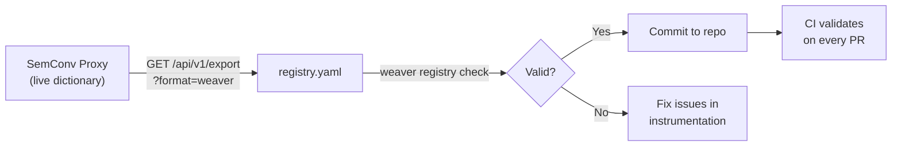

# Weaver Export

Export discovered semantic conventions in OTel Weaver-compatible YAML format.

## Endpoint

```
GET /api/v1/export
```

### Query Parameters

| Parameter | Type | Required | Description |
|-----------|------|----------|-------------|
| `format` | string | Yes | Export format — only `weaver` is supported |
| `type` | string | No | Filter by signal type: `metric`, `trace`, `log` |
| `prefix` | string | No | Filter by attribute/metric name prefix |

### Response

Content-Type: `text/yaml`

```yaml
groups:
  - id: metric.http.server.request.duration
    type: metric
    metric_name: http.server.request.duration
    brief: "Auto-discovered metric"
    instrument: histogram
    unit: s
    attributes:
      - id: http.request.method
        type: string
        requirement_level: recommended
    stability: experimental
    annotations:
      semconv.proxy.status: "matches_standard"
      semconv.proxy.first_seen: "2026-05-08T10:00:00Z"
      semconv.proxy.last_seen: "2026-05-08T15:30:00Z"
      semconv.proxy.cardinality: 6
```

### Examples

Export all conventions:

```bash
curl "http://localhost:8080/api/v1/export?format=weaver" -o registry.yaml
```

Export only metric conventions:

```bash
curl "http://localhost:8080/api/v1/export?format=weaver&type=metric" -o metrics.yaml
```

Export HTTP-related conventions:

```bash
curl "http://localhost:8080/api/v1/export?format=weaver&prefix=http" -o http-semconv.yaml
```

## Validation with Weaver

After exporting, validate the YAML with the OTel Weaver CLI:

```bash
weaver registry check -r registry.yaml
```

If validation passes, you can generate type-safe code:

```bash
weaver registry generate -r registry.yaml -t go /output/dir
```

## Export Format Details

The exported YAML follows OTel Weaver's semantic convention schema:

| Field | Description |
|-------|-------------|
| `groups[].id` | Group identifier, based on signal type and name |
| `groups[].type` | `metric`, `span`, `attribute_group`, or `log` |
| `groups[].metric_name` | Original metric name (for metric groups) |
| `groups[].instrument` | Instrument type: `counter`, `gauge`, `histogram`, etc. |
| `groups[].unit` | Unit of measurement |
| `groups[].attributes[]` | List of attribute definitions |
| `groups[].stability` | Always `experimental` for auto-discovered conventions |
| `groups[].annotations` | Proxy metadata (first_seen, last_seen, cardinality, status) |

## CI/CD Integration

```yaml
# .github/workflows/semconv-check.yaml
name: Semantic Convention Check
on: [push, pull_request]

jobs:
  check:
    runs-on: ubuntu-latest
    steps:
      - uses: actions/checkout@v4
      - name: Install Weaver
        run: |
          curl -sSL https://github.com/open-telemetry/weaver/releases/download/v0.8.0/weaver-v0.8.0-x86_64-linux.tar.gz | tar xz
          sudo mv weaver /usr/local/bin/
      - name: Check semantic conventions
        run: weaver registry check -r semconv/registry.yaml
```

## Workflow


