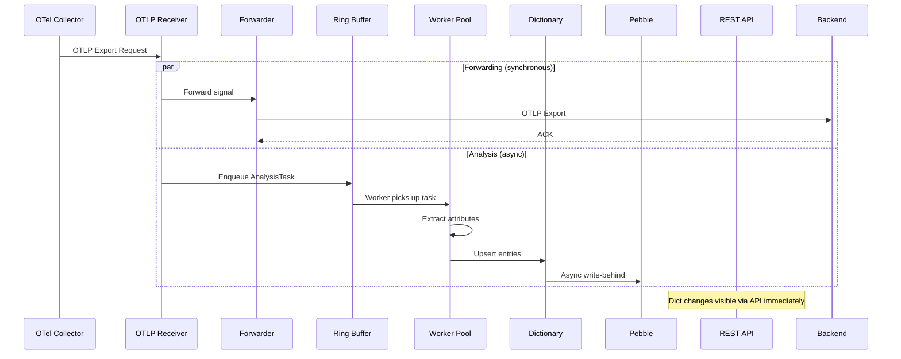

# Data Flow

Every OTLP signal that enters the proxy follows two parallel paths: a **forwarding path** that guarantees zero-loss delivery to the backend, and an **analysis path** that extracts semantic conventions.

## Signal Lifecycle

## Step-by-Step Breakdown

### 1. Signal Reception

The proxy listens on standard OTLP ports:

- **OTLP/HTTP** on port `4318` — accepts `POST /v1/metrics`, `/v1/traces`, `/v1/logs`
- **OTLP/gRPC** on port `4317` — standard gRPC OTLP export service

The receiver decodes the incoming protobuf payload and creates two references:

- A **forwarding reference** — passed directly to the forwarder
- An **analysis reference** — wrapped in an `AnalysisTask` and enqueued to the ring buffer

Both references use zero-copy semantics. No data is cloned.

### 2. Signal Forwarding (Hot Path)

The forwarder sends the original OTLP request to the configured backend endpoint. This path is:

- **Synchronous** with the receiver — the export response waits for backend acknowledgment
- **Never blocked** by analysis or storage — completely independent goroutine path
- **Retried** on transient failures with exponential backoff (up to 3 retries)
- **Monitored** via `semconv_proxy_signals_forwarded_total` and `semconv_proxy_signals_dropped_total`

If the backend is unreachable, the proxy continues analyzing signals and serving API requests. Forwarding retries in the background.

### 3. Ring Buffer (Decoupling Layer)

The ring buffer sits between signal reception and analysis processing:

- **Fixed capacity** (default: 10,000 tasks) — bounded memory usage
- **Drop-oldest overflow** — when full, the oldest analysis task is discarded
- **Never blocks the sender** — the write to the ring buffer is non-blocking
- **Monitored** via `semconv_proxy_pipeline_lag` and `semconv_proxy_pipeline_drops_total`

### 4. Worker Pool (Analysis)

A configurable pool of goroutines reads analysis tasks from the ring buffer:

- **Default workers** = number of CPU cores
- Each worker extracts attribute keys, value types, and signal metadata
- Extraction covers all three signal types: metrics, traces, and logs

For each signal type, the extractor pulls:

| Signal Type | Extracted Data |
|------------|---------------|
| Metrics | Name, type (counter, gauge, histogram, etc.), unit, temporality, attributes |
| Traces | Span name, attributes, status code, parent-child relationships |
| Logs | Attributes, severity level, body field patterns |

### 5. Dictionary Update

Extracted attributes are upserted into the sharded dictionary:

- **Upsert semantics** — new entries are created, existing entries are updated
- **Change detection** — tracks whether an attribute is new, changed, or unchanged
- **Timestamps** — `first_seen` and `last_seen` updated on every observation
- **Signal type tracking** — each attribute records which signal types it appeared in
- **Cardinality increment** — unique value count updated per attribute

Dictionary mutations are immediately visible through the REST API.

### 6. Persistence (Write-Behind)

Dictionary mutations are asynchronously persisted to Pebble:

- **Batch writes** — up to 1,000 entries per batch, flushed every 100ms
- **Key scheme** — `{signal_type}:{attribute_name}` (e.g., `metric:http.request.method`)
- **Serialization** — MessagePack for compact storage
- **Non-blocking** — persistence runs on a separate goroutine pool

### 7. API Access

The REST API reads from the in-memory dictionary:

- **Concurrent reads** — 64 shards with `sync.RWMutex` allow lock-free reads on non-contended shards
- **No caching** — API queries read live dictionary state directly
- **Target latency** — <10ms at p95 for queries returning up to 1,000 entries

## Data Guarantees

| Guarantee | Mechanism |
|-----------|-----------|
| Zero signal loss on forwarding | Forwarding is synchronous, independent of analysis |
| No forwarding latency impact | Ring buffer decouples analysis from forwarding |
| Bounded memory | Cardinality caps + global budget + ring buffer limit |
| Crash recovery | Pebble persistence + recovery on startup |
| Immediate API consistency | In-memory dictionary reads, no cache staleness |
