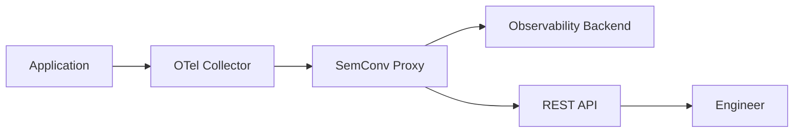
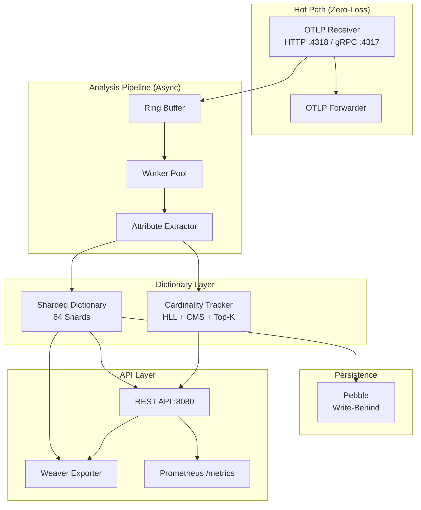

# Architecture Overview

SemConv Proxy intercepts OTLP signals on their way from instrumented applications (via OpenTelemetry Collectors) to your observability backend. It forwards every signal unmodified while asynchronously building a live dictionary of discovered semantic conventions.

## Pipeline Position

The proxy is a drop-in component. You point your existing OTel Collector exporters at the proxy instead of directly at the backend. No application or Collector configuration changes are needed beyond the endpoint URL.

## Core Architecture

## Key Design Decisions

| Decision | Choice | Rationale |
|----------|--------|-----------|
| Language | Go | OTel ecosystem compatibility, low-latency networking |
| Storage | Pebble | Low memory/CPU overhead, embedded, crash-recoverable |
| Dictionary | 64 shards with FNV-1a | Concurrent reads without lock contention |
| Analysis | Ring buffer + worker pool | Decouples analysis from forwarding |
| API framework | Go standard library `net/http` | Minimal dependencies, sufficient for <10 endpoints |
| Logging | `log/slog` | Standard library, structured JSON, no external dependency |
| Metrics | Prometheus client | De facto standard for Kubernetes metric collection |

## Performance Targets

| Metric | Target |
|--------|--------|
| Forwarding latency overhead (p99) | <1ms |
| Burst throughput | 50,000 signals/sec |
| API response time (p95) | <10ms |
| Crash recovery | <5 seconds |
| Memory (10K attributes) | <512MB |
| Forwarding reliability | 100% pass-through |

## Technology Stack

| Component | Technology |
|-----------|-----------|
| Runtime | Go 1.23+ |
| Protocol | OTLP (HTTP + gRPC) via OTel Collector SDK |
| Storage | Pebble LSM-tree |
| API | `net/http` (Go standard library) |
| CLI | Cobra + Viper |
| Metrics | Prometheus client_golang |
| Logging | `log/slog` (JSON) |
| Cardinality | HyperLogLog, Count-Min Sketch |
| Serialization | MessagePack (persistence), JSON (API) |
