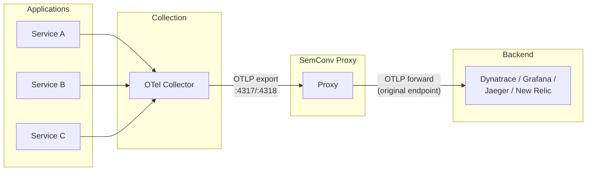
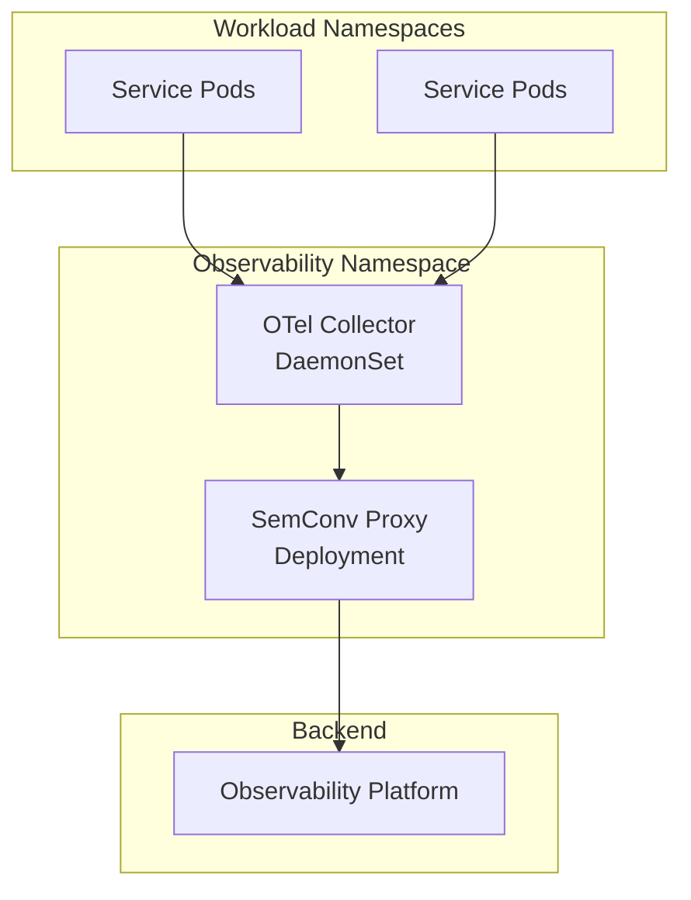
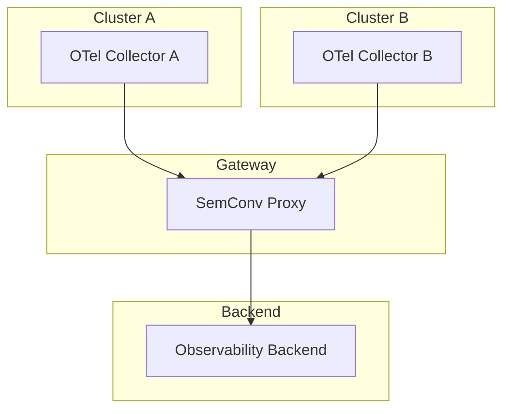
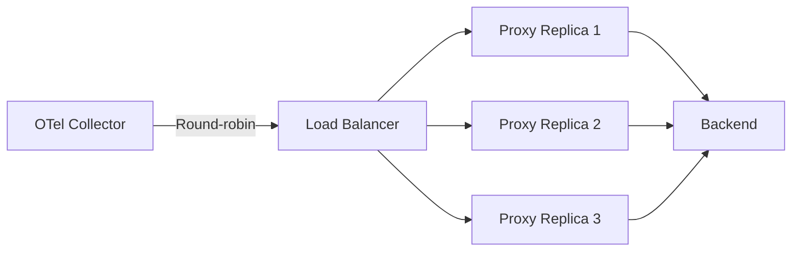

# Telemetry Pipeline Integration

SemConv Proxy is designed to be a drop-in component in your existing OpenTelemetry telemetry pipeline. This page covers common integration patterns.

## Standard Deployment Pattern

The most common pattern: proxy sits between your OTel Collector and the backend.



**Collector configuration change:**

```yaml
exporters:
  otlp:
    endpoint: "semconv-proxy.observability:4317"
    # Was previously: backend-endpoint:4317
```

That's the only change needed. The proxy forwards to the actual backend using its `--backend-endpoint` flag.

## Dev Environment Pattern

For local development, run the proxy alongside your application:

```yaml
# docker-compose.yaml
services:
  app:
    build: .
    environment:
      OTEL_EXPORTER_OTLP_ENDPOINT: "http://proxy:4318"

  proxy:
    image: ghcr.io/henrikrexed/semconv-proxy:latest
    ports:
      - "8080:8080"
    command:
      - --backend-endpoint=jaeger:4317
      - --log-level=debug

  jaeger:
    image: jaegertracing/all-in-one:latest
    ports:
      - "16686:16686"
```

The developer queries `http://localhost:8080/api/v1/dictionary` to see what their service actually emits.

## Kubernetes Pattern

Deploy the proxy as a sidecar or a central service in your observability namespace.

### Central Service (Recommended)



```bash
helm install semconv-proxy ./deployments/helm/semconv-proxy/ \
  --set config.backendEndpoint=otel-collector.observability:4317 \
  --set persistence.enabled=true \
  --set persistence.size=5Gi
```

Then update your OTel Collector exporters:

```yaml
# OTel Collector config
exporters:
  otlp:
    endpoint: "semconv-proxy.observability:4317"
    tls:
      insecure: true
```

### Sidecar Pattern

For per-service isolation, deploy as a sidecar:

```yaml
# In your pod spec
containers:
  - name: semconv-proxy
    image: ghcr.io/henrikrexed/semconv-proxy:latest
    args:
      - --backend-endpoint=otel-collector.observability:4317
      - --api-port=8080
    ports:
      - containerPort: 4317
      - containerPort: 4318
      - containerPort: 8080
```

Point your application's OTel SDK at `localhost:4318`.

## Gateway Pattern

For multi-cluster or multi-team environments, deploy the proxy as a gateway:



Each cluster sends telemetry through the shared proxy. The proxy's dictionary accumulates conventions from all clusters, giving a unified view.

## Load-Balanced Deployment

For high-throughput environments (>50K signals/sec), run multiple proxy replicas behind a load balancer:



!!! warning "Dictionary Fragmentation"
    Each replica maintains its own dictionary. For a unified view, query all replicas and merge results, or use sticky sessions to route each service's telemetry to the same replica.

## Backend Compatibility

The proxy works with any OTLP-compatible backend:

| Backend | Protocol | Tested |
|---------|----------|--------|
| Dynatrace | OTLP/HTTP | Yes |
| Grafana Tempo | OTLP/gRPC | Yes |
| Jaeger | OTLP/gRPC | Yes |
| New Relic | OTLP/HTTP | Yes |
| Splunk Observability | OTLP/HTTP | Yes |
| Google Cloud Operations | OTLP/gRPC | Yes |
| Any OTel Collector | OTLP HTTP/gRPC | Yes |

## Migration Path

To add the proxy to an existing pipeline with zero downtime:

1. Deploy the proxy pointing at your current backend
2. Switch one Collector's export endpoint to the proxy
3. Verify signals arrive at the backend unchanged
4. Gradually switch remaining Collectors
5. Enable persistence and tune cardinality limits

No application restarts required. The proxy is transparent to both the Collector and the backend.
