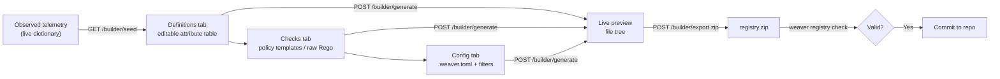

# Weaver Asset Builder

The **Weaver Asset Builder** turns the telemetry the proxy has observed into a
complete, validatable [OTel Weaver](https://github.com/open-telemetry/weaver)
registry that you can commit to a repository. Where [Weaver
Export](../api/weaver-export.md) gives you a one-shot YAML dump of live data,
the Builder is an interactive authoring surface: you curate definitions, attach
policy checks, configure the Weaver toolchain, and export a zip whose contents
pass `weaver registry check`.

It is part of the embedded [web UI](web-ui.md) — open the proxy's API port and
switch the header scope to **Weaver Asset Builder** (or append `#scope=builder`
to the URL).

```
http://<host>:8080/#scope=builder
```

## At a glance



Every edit re-posts the current builder state to
[`POST /api/v1/builder/generate`](../api/builder.md#generate) (debounced) and
re-renders the generated file tree, so the preview always matches what the zip
will contain.

## The manifest

At the top of the Builder sits the **manifest** form. The **schema URL** is
required and must be a *versioned* OTel schema URL — an `http(s)` URL whose final
path segment looks like a version, e.g. `https://acme.com/schemas/0.1.0`. The
optional **description** is carried into the generated `registry_manifest.yaml`.

Until a valid schema URL is set, the preview stays empty.

## 1. Definitions

The **Definitions** tab is an editable attribute table seeded from
[`GET /api/v1/builder/seed`](../api/builder.md#seed). Each observed attribute is
pre-filled from the live telemetry and cross-referenced against the official
registry:

- **Type** is pre-filled from the *observed* telemetry type (hover for the
  observed value).
- **Stability**, **requirement level**, **brief**, and **examples** are
  editable. When an attribute *matched* the official registry, those fields are
  pre-filled with the official wording so you can accept it instead of retyping.
- The **Community** column shows a status chip from the cross-reference bucket:
  `matched`, `type mismatch`, `deprecated`, or `not in registry`.

Use the **group tools** to assign a namespace to selected rows (e.g.
`acme.payments`). Attributes are emitted into `groups/<namespace>.yaml` under
their assigned namespace; un-namespaced attributes fall back to `custom`.

!!! note
    The table seeds from attributes the proxy has actually seen. If it is empty,
    send some telemetry through the proxy and reopen the Builder.

## 2. Checks

The **Checks** tab attaches Weaver policy checks to your registry. Each check
emits a `policies/<name>.rego` file. There are two paths:

**Policy templates (the common path).** Add a check from the catalog served by
[`GET /api/v1/builder/policy-templates`](../api/builder.md#policy-templates) and
fill in its parameters. The built-in catalog includes:

| Template | What it enforces |
|----------|------------------|
| Naming prefix required | Every attribute name starts with a required prefix |
| Namespace allow-list | Names must start with one of an allowed set of prefixes |
| Stability required | Every attribute declares a stability level |
| Requirement level required | Every attribute declares a `requirement_level` |
| No deprecation without replacement | A deprecated attribute points at a `renamed_to` |
| Attribute type consistency | A named attribute uses its expected type |

**Raw Rego (advanced escape hatch).** Hand-write a policy. The output is passed
through unmodified — you own the Weaver policy contract for what you write.

Only complete checks (all required params filled, or non-empty raw source) are
included in the preview, so an in-progress check never breaks generation.

## 3. Config

The **Config** tab optionally emits a `.weaver.toml` that wires the toolchain
together. Enable **Emit `.weaver.toml`** and fill in only what you need — blank
fields take Weaver's defaults (`registry.path = "."`,
`policy.paths = ["policies"]`):

- **Registry & policy** — registry path, policy paths, skip-policy toggle.
- **Live check** — advice policies directory and a jq advice preprocessor.
- **Diagnostics** — output format (e.g. `ansi`).
- **Finding filters** — drop live-check findings by id, sample key, minimum
  level (`information` / `improvement` / `violation`), or signal-type scope. The
  signal-type options are sourced from the signals your telemetry actually
  carries.

## 4. Preview & export

The **preview** pane renders the generated registry as a directory tree that
mirrors what you will commit:

```
registry_manifest.yaml
groups/
  acme.payments.yaml
policies/
  naming_prefix_required.rego
.weaver.toml          # only when Config emission is enabled
```

Expand any file to inspect its source, download an individual file, or click
**Download all (.zip)** to fetch the whole registry from
[`POST /api/v1/builder/export.zip`](../api/builder.md#export-zip). The archive
unpacks to a directory that passes:

```bash
unzip registry.zip -d my-registry
weaver registry check -r my-registry
```

Once it checks out, commit the directory to your repo and wire
`weaver registry check` into CI exactly as in the
[Weaver Export CI/CD example](../api/weaver-export.md#cicd-integration).

## Designed, not yet shipped

A server-side `/api/v1/builder/validate` endpoint and an in-proxy
`weaver registry check` validation loop are designed but gated, so today
validation happens with the Weaver CLI against the exported zip rather than
inside the proxy.
