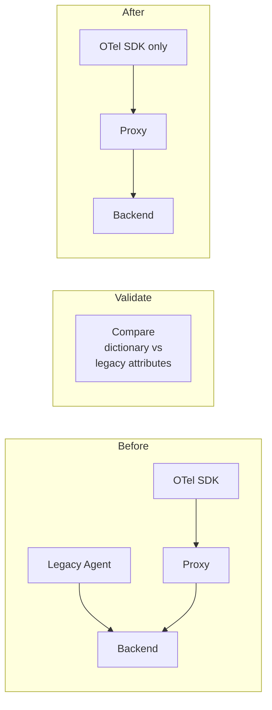

# Migration Tracking

## The Problem

You're migrating from a legacy instrumentation setup to OpenTelemetry. Or you're upgrading OTel semantic convention versions (e.g., from v1.20 to v1.27). You need to answer:

- What does this application *actually* emit right now?
- Are there conventions from the old system still lingering?
- Did the migration introduce new, unexpected attributes?
- Are there naming mismatches between old and new conventions?

## The Solution

Run SemConv Proxy alongside the application and compare what it discovers against your expected conventions.

## Walkthrough

### Scenario: OTel Convention Version Upgrade

You're upgrading from HTTP conventions that used `http.method` to the newer `http.request.method`.

### Step 1: Deploy the Proxy

```bash
docker run -p 4317:4317 -p 4318:4318 -p 8080:8080 \
  ghcr.io/henrikrexed/semconv-proxy:latest \
  --backend-endpoint=otel-collector:4317
```

### Step 2: Run Traffic

Send representative traffic through the application. Exercise key code paths.

### Step 3: Check for Old Conventions

Search for attributes that should have been migrated:

```bash
# Look for old-style HTTP attributes
curl "http://localhost:8080/api/v1/dictionary?q=http.*" | jq '.entries[] | select(.name == "http.method")'
```

If you find `http.method` instead of `http.request.method`, the migration is incomplete.

### Step 4: Compare Emitted vs Expected

Create a snapshot before the migration:

```bash
# Before migration
curl "http://localhost:8080/api/v1/export?format=weaver" -o before-migration.yaml
```

Apply the migration, redeploy, run traffic again:

```bash
# After migration
curl "http://localhost:8080/api/v1/export?format=weaver" -o after-migration.yaml
```

Compare the two exports:

```bash
diff before-migration.yaml after-migration.yaml
```

### Step 5: Identify Unexpected Attributes

```bash
# Find custom/non-standard attributes
curl "http://localhost:8080/api/v1/dictionary" | jq '.entries[] | select(.classification == "custom")'
```

## Scenario: Legacy-to-OTel Migration

When migrating from a proprietary agent to OpenTelemetry:

1. **Before migration**: Run the proxy alongside the legacy agent. The proxy sees what the OTel SDK emits and builds the dictionary.
2. **During migration**: Compare the dictionary against the legacy system's known attributes.
3. **After migration**: Verify no telemetry gaps — every attribute from the legacy system has an OTel equivalent.



## Key Benefits

- **No guessing** — see exactly what the application emits, not what you think it emits
- **Diff-based validation** — compare before/after snapshots to catch regressions
- **Continuous monitoring** — leave the proxy running to catch future drift
