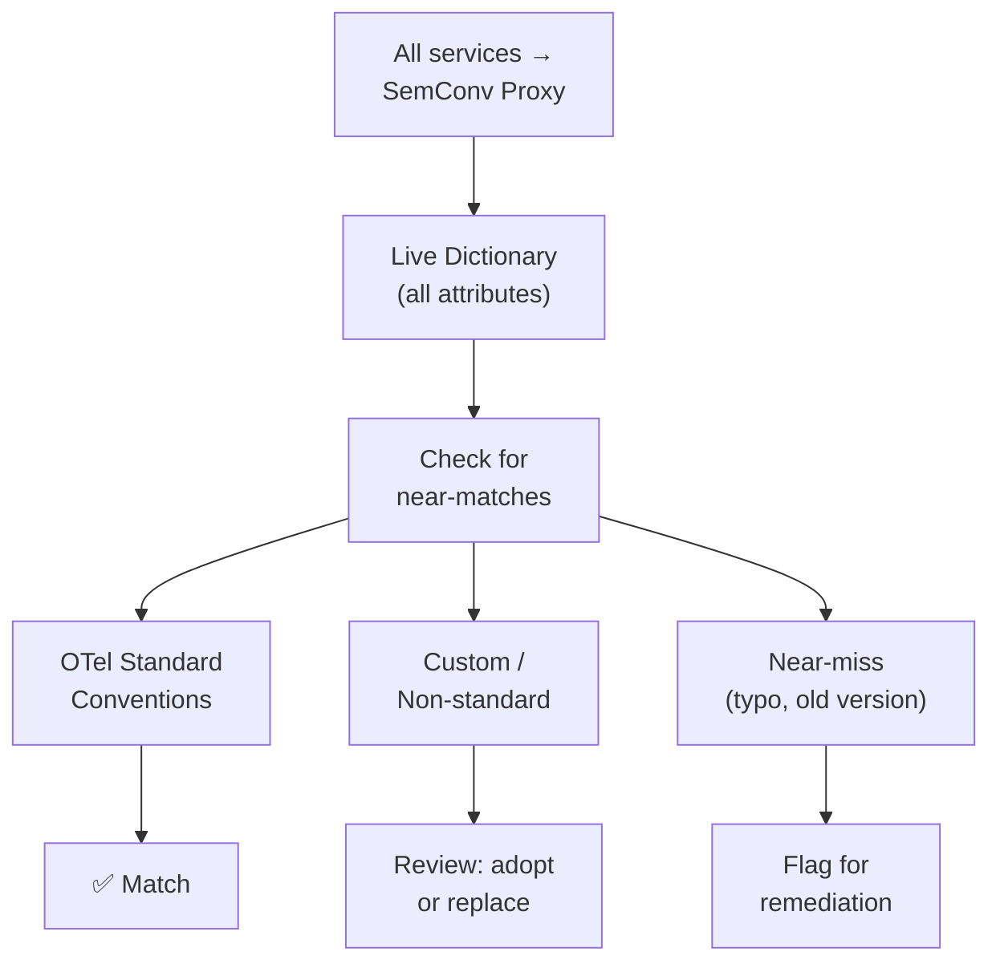

# Multi-Source Aggregation — Platform Team Monitoring

## The Problem

As a platform team, you manage observability infrastructure for dozens of service teams. Each team instruments their services independently. Over time, semantic conventions drift:

- Team A uses `http.request.method` while Team B uses `http.method`
- One team emits `k8s.namespace.name`, another uses `kubernetes.namespace`
- Custom attributes accumulate without standardization
- New team members don't know which conventions to follow

You need visibility into convention drift across all services.

## The Solution

Deploy SemConv Proxy as a central aggregation point. All OTel Collectors in the organization route through the proxy. The dictionary captures every attribute across every service.

## Walkthrough

### Step 1: Central Deployment

```bash
helm install semconv-proxy ./deployments/helm/semconv-proxy/ \
  --set config.backendEndpoint=otel-collector-gateway.observability:4317 \
  --set config.globalBudget=50000 \
  --set config.perAttrCap=2000 \
  --set persistence.enabled=true \
  --set persistence.size=5Gi \
  --set resources.limits.memory=1Gi
```

Note the higher global budget (50K) and per-attr cap (2K) for a platform-wide deployment.

### Step 2: Route All Collectors Through the Proxy

Update each OTel Collector's configuration:

```yaml
# Team A's Collector
exporters:
  otlp:
    endpoint: "semconv-proxy.observability:4317"

# Team B's Collector
exporters:
  otlp:
    endpoint: "semconv-proxy.observability:4317"
```

### Step 3: Identify Convention Drift

Query the dictionary for naming inconsistencies:

```bash
# Find HTTP-related attributes
curl "http://semconv-proxy:8080/api/v1/dictionary?q=http.*method" | \
  jq '.entries[] | {name, signal_types, cardinality}'
```

You might discover:

```json
[
  {"name": "http.request.method", "signal_types": ["metric", "trace"], "cardinality": 6},
  {"name": "http.method", "signal_types": ["trace"], "cardinality": 6},
  {"name": "httpReqMethod", "signal_types": ["log"], "cardinality": 7}
]
```

Three different conventions for the same concept. Time to standardize.

### Step 4: Find Kubernetes Naming Inconsistencies

```bash
curl "http://semconv-proxy:8080/api/v1/dictionary?q=k8s.*" | \
  jq '.entries[] | {name, cardinality}'
```

### Step 5: Export the Complete Convention Registry

```bash
curl "http://semconv-proxy:8080/api/v1/export?format=weaver" -o org-semconv-registry.yaml
```

Share this registry with all teams as the source of truth.

### Step 6: Set Up Drift Alerts

Create a periodic job that checks for new custom attributes:

```bash
#!/bin/bash
# drift-check.sh — run daily via cron
PREVIOUS=$(cat /data/previous-count.txt 2>/dev/null || echo 0)
CURRENT=$(curl -s http://semconv-proxy:8080/api/v1/dictionary | jq '.total')
echo "$CURRENT" > /data/previous-count.txt

if [ "$CURRENT" -gt "$((PREVIOUS + PREVIOUS / 10))" ]; then
  echo "WARNING: Attribute count grew by >10% ($PREVIOUS → $CURRENT)"
  # Send notification
fi
```

## Convention Comparison Workflow



## Dashboard

Build a Grafana dashboard using the proxy's Prometheus metrics:

| Panel | Metric | Purpose |
|-------|--------|---------|
| Total Attributes | `semconv_proxy_dictionary_entries` | Track convention count over time |
| Attributes Added | `rate(semconv_proxy_dictionary_attributes_added_total[1h])` | Detect new conventions being introduced |
| High-Cardinality Count | `semconv_proxy_cardinality_high_attributes` | Monitor cardinality health |
| Budget Utilization | `semconv_proxy_cardinality_budget_utilization` | Track dictionary capacity |
| Pipeline Drops | `rate(semconv_proxy_pipeline_drops_total[5m])` | Check if analysis is keeping up |

## Platform Team Benefits

- **Unified visibility** — one dictionary for the entire organization
- **Drift detection** — spot naming inconsistencies across teams
- **Standardization evidence** — data-driven conversations about convention adoption
- **Cardinality governance** — prevent costly backend explosions before they happen
- **Onboarding** — new teams see what conventions the organization uses
