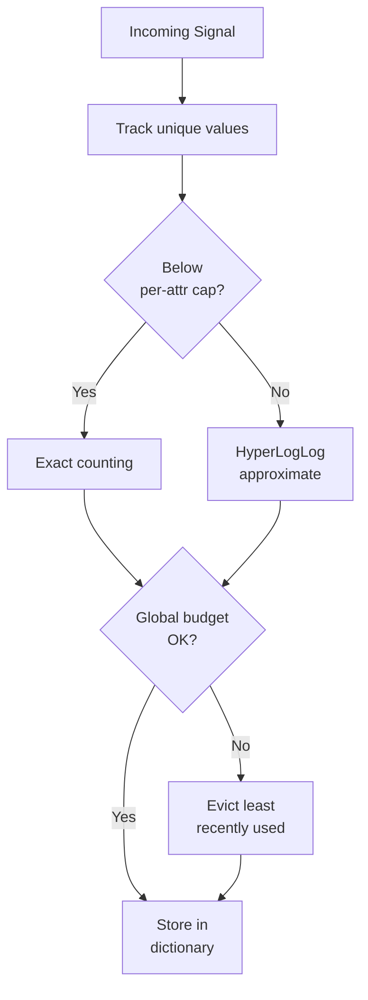

# Observability Pipeline — Cardinality Management

## The Problem

High-cardinality attributes cause expensive backend queries, increased storage costs, and slow dashboards. An attribute like `user.id` or `k8s.pod.name` with thousands of unique values can explode your backend costs. But you often don't know which attributes are the worst offenders until it's too late.

## The Solution

SemConv Proxy tracks cardinality for every discovered attribute and exposes it through a dedicated API endpoint and Prometheus metrics.

## Walkthrough

### Step 1: Deploy with Monitoring

```bash
helm install semconv-proxy ./deployments/helm/semconv-proxy/ \
  --set config.backendEndpoint=otel-collector.observability:4317 \
  --set config.globalBudget=10000 \
  --set config.perAttrCap=1000
```

### Step 2: Monitor Cardinality Metrics

Add these Prometheus alerts to your monitoring stack:

```yaml
groups:
  - name: semconv-proxy-cardinality
    rules:
      - alert: HighCardinalityDetected
        expr: semconv_proxy_cardinality_high_attributes > 5
        for: 10m
        labels:
          severity: warning
        annotations:
          summary: "High-cardinality attributes detected"

      - alert: CardinalityBudgetApproaching
        expr: semconv_proxy_cardinality_budget_utilization > 80
        for: 5m
        labels:
          severity: warning
        annotations:
          summary: "Cardinality budget is above 80% utilization"
```

### Step 3: Investigate High-Cardinality Attributes

When an alert fires, investigate:

```bash
curl "http://semconv-proxy:8080/api/v1/cardinality" | jq .
```

Response:

```json
{
  "global_budget": {
    "used": 342,
    "limit": 10000,
    "utilization_pct": 3.42
  },
  "attributes": [
    {
      "name": "k8s.pod.name",
      "cardinality": 847,
      "cap": 1000,
      "utilization_pct": 84.7
    },
    {
      "name": "user.id",
      "cardinality": 523,
      "cap": 1000,
      "utilization_pct": 52.3
    }
  ]
}
```

Filter by threshold to focus on the worst offenders:

```bash
curl "http://semconv-proxy:8080/api/v1/cardinality?threshold=100" | jq .
```

### Step 4: View Top Values for Diagnosis

Get the top values for a specific high-cardinality attribute:

```bash
curl "http://semconv-proxy:8080/api/v1/dictionary/k8s.pod.name" | jq '.top_values'
```

Response:

```json
[
  {"value": "api-gateway-7d4f8b-x2k9", "approximate_count": 45230},
  {"value": "api-gateway-7d4f8b-m3p1", "approximate_count": 12340},
  {"value": "payment-svc-9c2e1-a5n7", "approximate_count": 8900}
]
```

### Step 5: Take Action

Based on the cardinality data:

| Finding | Action |
|---------|--------|
| `k8s.pod.name` has 847 unique values | Add a Collector processor to drop or aggregate pod-level attributes |
| `user.id` has 523 unique values | Stop propagating user ID as a metric attribute; move to trace-only |
| `request.path` has 200 unique values | Normalize paths (e.g., `/users/123` → `/users/{id}`) |

### Step 6: Monitor Improvement

After making changes, track cardinality reduction over time:

```bash
# Prometheus query
rate(semconv_proxy_cardinality_high_attributes[1h])
```

## Built-in Safeguards

The proxy enforces cardinality limits automatically:

| Mechanism | Default | Behavior |
|-----------|---------|----------|
| Per-attribute cap | 1,000 | Switches to approximate counting above this limit |
| Global budget | 10,000 | Evicts least-recently-used entries when exceeded |
| TTL stale | 24 hours | Marks entries stale if not seen for 24h |
| TTL purge | 7 days | Removes stale entries after 7 days |



## Result

You've identified the root cause of cardinality explosions in minutes instead of hours, using real data from the proxy's live dictionary.
