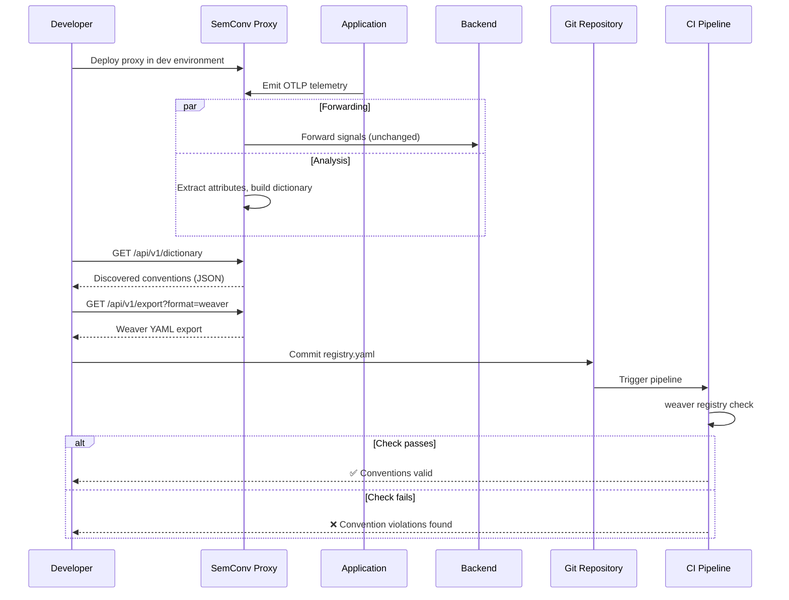
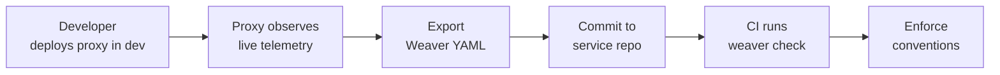

# Semantic Convention Discovery

## What This Use Case Achieves

Semantic Convention Discovery turns the opaque world of distributed telemetry into a queryable, version-controlled asset. By deploying SemConv Proxy in your development environment, you get a live dictionary of every attribute, metric name, and span convention your services emit — without writing a single line of Weaver YAML manually. The workflow takes you from zero visibility to a CI-enforced semantic convention registry.

## The Problem

You have dozens of services instrumented with OpenTelemetry. Each emits metrics, traces, and logs with various attributes. But you don't have a clear picture of:

- Which semantic conventions are actually in use
- Which services use which attributes
- Whether teams follow your organization's naming standards
- What custom (non-standard) attributes exist

OTel Weaver requires you to write semantic convention YAML by hand — a top-down, manual process. This is error-prone when you have many services.

## Dev Workflow Flow



## The Solution

Deploy SemConv Proxy in your development environment. It observes live telemetry and builds a complete dictionary of every attribute, metric, and span convention across all services.

## Step-by-Step Implementation Guide

### Step 1: Deploy the Proxy in Your Development Environment

```bash
helm install semconv-proxy ./deployments/helm/semconv-proxy/ \
  --set config.backendEndpoint=otel-collector.observability:4317 \
  --set persistence.enabled=true
```

Update your OTel Collector to export through the proxy:

```yaml
exporters:
  otlp:
    endpoint: "semconv-proxy.observability:4317"
```

### Step 2: Generate Traffic and Observe

Let the proxy run for several hours (or days) during normal development traffic. The dictionary accumulates all discovered conventions.

### Step 3: Browse and Query Discovered Conventions

```bash
curl http://semconv-proxy:8080/api/v1/dictionary | jq .
```

Filter by signal type:

```bash
curl "http://semconv-proxy:8080/api/v1/dictionary?type=metric" | jq .
```

Search for specific attributes:

```bash
curl "http://semconv-proxy:8080/api/v1/dictionary?q=http.*" | jq .
```

Sort by cardinality to find the most diverse attributes:

```bash
curl "http://semconv-proxy:8080/api/v1/dictionary?sort=cardinality&order=desc&limit=10" | jq .
```

### Step 4: Export Weaver YAML for Your Repository

```bash
curl "http://semconv-proxy:8080/api/v1/export?format=weaver" -o semconv/registry.yaml
```

Store the YAML in your service repository:

```
my-service/
├── semconv/
│   └── registry.yaml    ← Exported from proxy
├── src/
└── .github/
    └── workflows/
        └── ci.yaml      ← Runs weaver registry check
```

### Step 5: Validate with OTel Weaver

```bash
weaver registry check -r semconv/registry.yaml
```

### Step 6: Automate Validation in CI/CD

Add a Weaver check to your CI pipeline:

```yaml
# .github/workflows/ci.yaml
steps:
  - name: Check semantic conventions
    run: weaver registry check -r semconv/registry.yaml
```

## Result

You've gone from "we don't know what our services emit" to a validated, version-controlled semantic convention registry — without writing a single YAML line manually.

## Dev Workflow Summary


